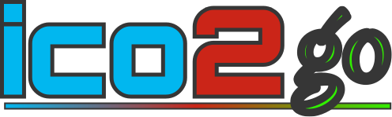
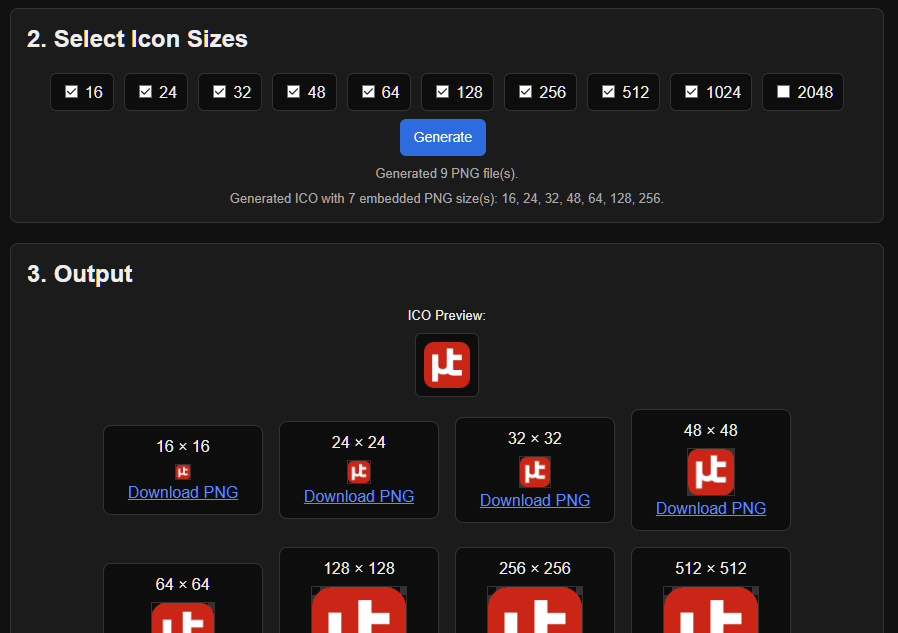

<!-- markdownlint-disable MD041 -->


<p align="center">
  
</p>

<p align="center">
  <strong>Free&nbsp;•&nbsp;Open&nbsp;Source&nbsp;•&nbsp;MIT Licensed</strong>
</p>


<p align="center">
  
</p>

---

ico2go was created to speed up the process of creating *.ico files from SVG inputs.  I thought my former process of copy-pasting-resizing an SVG multiple times, exporting all the sizes to different PNG files, then uploading to any of one of the online conversion websites to be a little tedious.

The entire project is functionally contained in the single HTML file - other than two images that are not required - with zero depenencies on external libraries. You can download and store a local copy to disk if you want or need an offline version.

---

## ✨ Features & Info

- Creates ico files pretty dang quick.
- Ideally, use an SVG - whicih allows for 'lossless' upscaling.
- PNG upscaling is disabled, so use the largest PNG you have.
- Attempts to center and bound non-square input sources.
- Converts first to multiple PNG sizes (as selected) then batches those into a single ICO file.
- The ideal input file is:
  - SVG File Format
  - Square dimensions (n x n)
  - Rendered Properly in Browser
- I tried out a weird detail-summary 'trick' to fade in and scroll the various steps and areas of the process. If you find ico2go is not rendering properly in your browser, try clicking the eye button on the top right.
- Toggle light/dark modes with the sun icon on the top right.
- ICO2GO will not render properly in the AOL 2.5 browser.

## 📝 License

<details>
<summary>MIT License – click to expand</summary>

```text
MIT License

Copyright (c) 2026 Stephen Thomas

Permission is hereby granted, free of charge, to any person obtaining a copy
of this software and associated documentation files (the "Software"), to deal
in the Software without restriction, including without limitation the rights
to use, copy, modify, merge, publish, distribute, sublicense, and/or sell
copies of the Software, and to permit persons to whom the Software is
furnished to do so, subject to the following conditions:

The above copyright notice and this permission notice shall be included in all
copies or substantial portions of the Software.

THE SOFTWARE IS PROVIDED "AS IS", WITHOUT WARRANTY OF ANY KIND, EXPRESS OR
IMPLIED, INCLUDING BUT NOT LIMITED TO THE WARRANTIES OF MERCHANTABILITY,
FITNESS FOR A PARTICULAR PURPOSE AND NONINFRINGEMENT. IN NO EVENT SHALL THE
AUTHORS OR COPYRIGHT HOLDERS BE LIABLE FOR ANY CLAIM, DAMAGES OR OTHER
LIABILITY, WHETHER IN AN ACTION OF CONTRACT, TORT OR OTHERWISE, ARISING FROM,
OUT OF OR IN CONNECTION WITH THE SOFTWARE OR THE USE OR OTHER DEALINGS IN THE
SOFTWARE.

```

</details>

---

<p align="center">An excerpt from the ICO Generators Creed:</p>

<p align="center"><small>1. This is my ico-geneator. There are many like it, but this one is mine.</small></p>

<p align="center"><small><s>2. My ico-geneator is my best friend. It is my life. I must master it as I must master my life.</s></small></p>

<p align="center"><small><s>3. My ico-geneator, without me, is useless. Without my ico-geneator, I am useless.</small></p></s>

